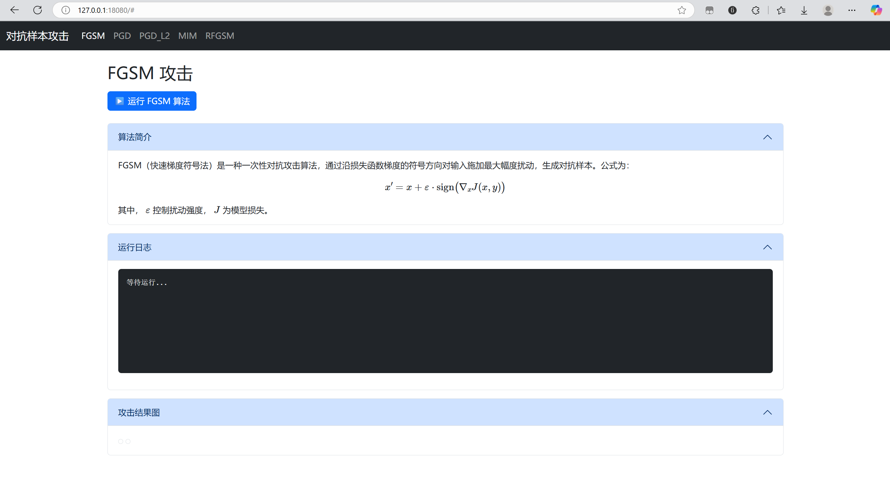

# 工科创II大作业

## 项目简介

项目使用一个运行在本地服务器的网页展示对抗样本攻击诸算法（FGSM、PGD、PGD_L2、MIM、RFGSM）的运行和结果，前端html/css/js/bootstrap，后端Flask。

## 本地部署说明

进入 `src/` 目录，运行 `npm i` 安装项目所需的 bootstrap 和 MathJax 包。

运行 `pip install -r requirements.txt` 安装python依赖。（torch建议另行安装）

运行 `flask run` 启动服务器（默认运行在 `127.0.0.1:18080` 上，如有需要可在 `.flaskenv` 文件中进行修改）。

在浏览器中打开 `127.0.0.1:18080`，可以看到如下的页面。

点击顶部导航栏的“PGD”、“PGD_L2”、“MIM”、“RFGSM”可以看到不同的攻击算法对应的页面，每个页面都包括“算法简介”“运行日志”和“攻击结果图”三个主要部分。点击蓝色的运行按钮开始运行（通常耗时很久），算法的运行日志会在下方“运行日志”部分显示，运行完毕后会生成攻击样例展示图和攻击效果图，显示在“攻击结果图”部分中。